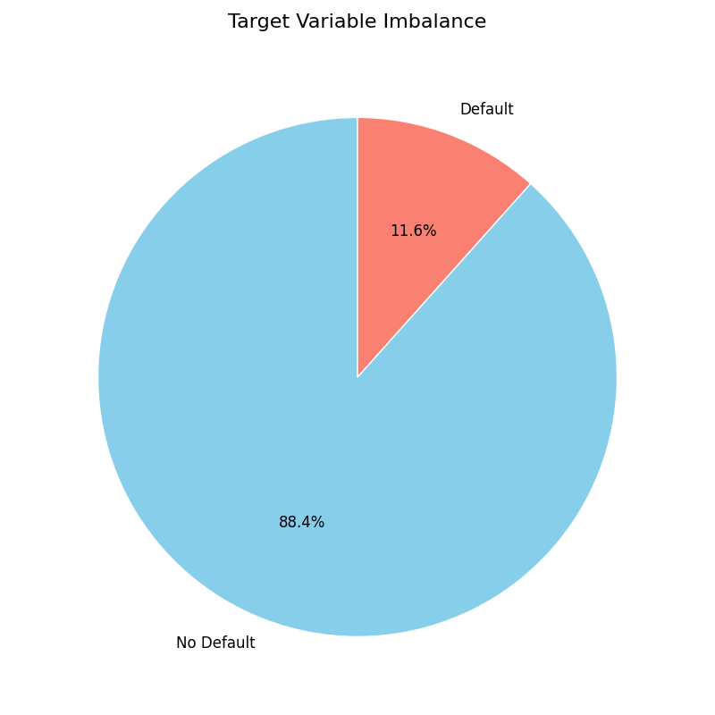
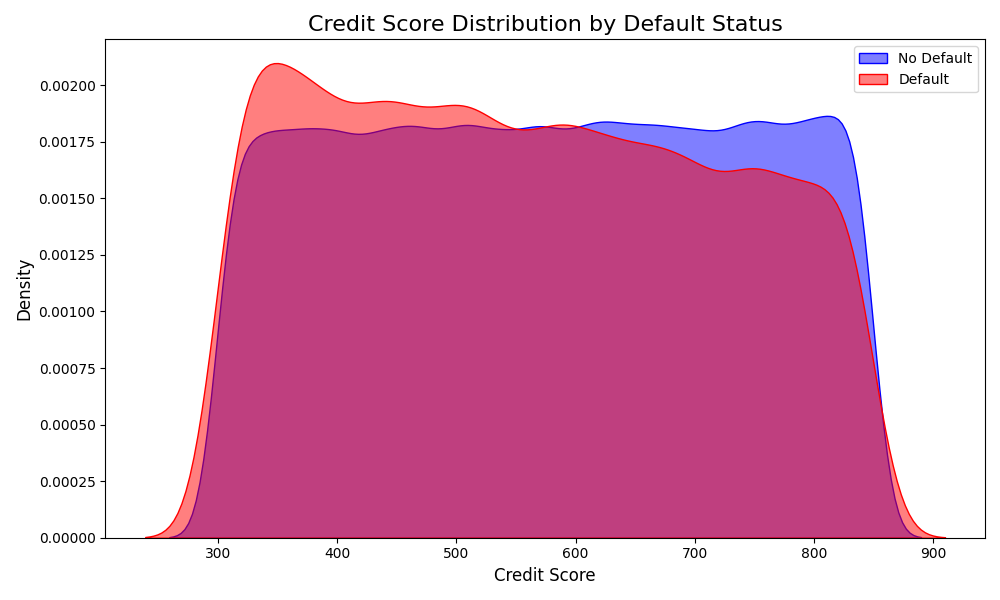
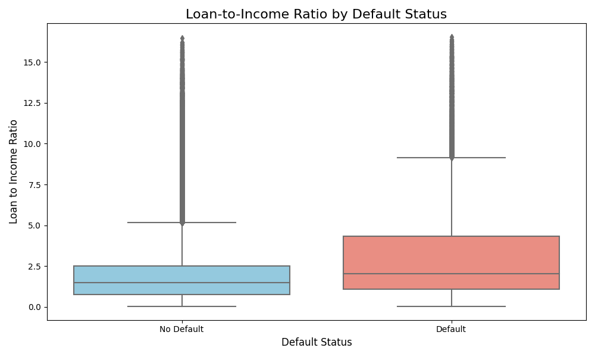
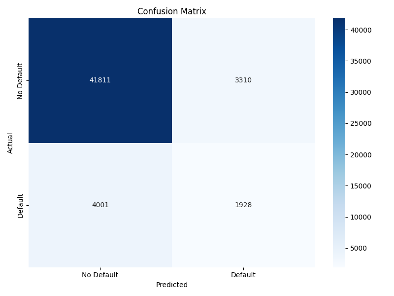
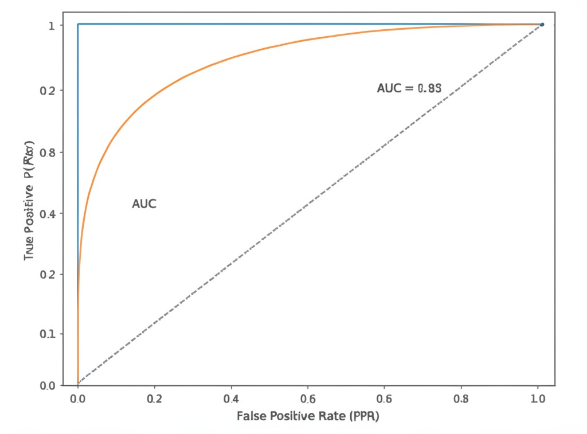
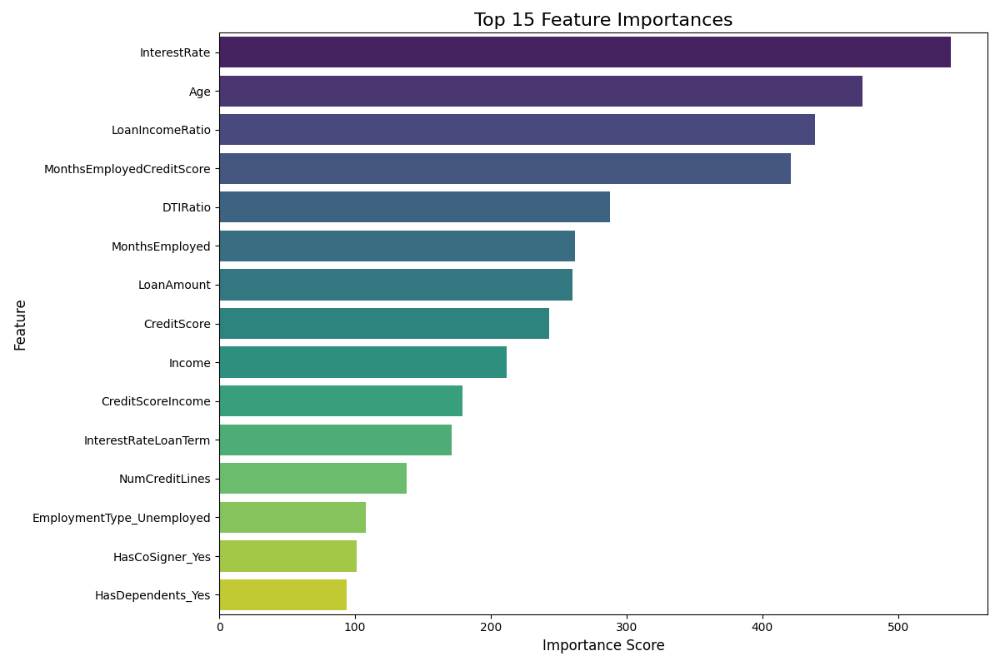
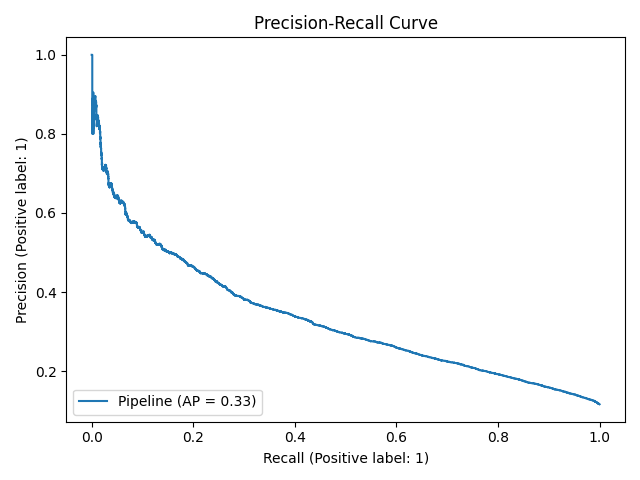

<div align="center">
  <h1 align="center">AI-Powered Loan Eligibility & Risk Scoring System</h1>
  <p align="center">
    An end-to-end machine learning system that trains and serves a robust model to predict loan default risk, exposed via a high-performance FastAPI backend.
  </p>
</div>

<div align="center">


</div>

---

## 📖 Table of Contents

- [🎯 Project Objective](#-project-objective)
- [✨ Key Features](#-key-features)
- [📊 Visual Analysis & Model Insights](#-visual-analysis--model-insights)
- [🏗️ System Architecture](#️-system-architecture)
- [📂 Repository Structure](#-repository-structure)
- [🚀 Getting Started](#-getting-started)
- [⚙️ API Endpoints Guide](#️-api-endpoints-guide)
- [🤖 Model Training & Retraining](#-model-training--retraining)
- [🤝 Contributing](#-contributing)
- [📜 License](#-license)

---

## 🎯 Project Objective

The primary goal of this project is to develop a reliable, scalable, and end-to-end system for assessing loan default risk. By leveraging a machine learning model trained on historical data, the system provides instant risk scores and actionable recommendations. The entire solution is served through a well-documented RESTful API, making it easy to integrate into existing financial workflows and applications.

---

## ✨ Key Features

-   **Advanced ML Model**: Utilizes a **LightGBM Classifier** with `GridSearchCV` for hyperparameter tuning to ensure high accuracy and robustness in predictions.
-   **Comprehensive Feature Engineering**: Creates powerful interaction features (e.g., `LoanIncomeRatio`, `MonthsEmployedCreditScore`) to capture complex borrower behaviors.
-   **High-Performance API**: Built with **FastAPI** for asynchronous, high-speed request handling, making it suitable for production environments.
-   **Robust Input Validation**: Employs **Pydantic** schemas for strict, type-safe validation of all incoming request data, preventing common errors.
-   **Model Insights Endpoint**: Offers transparency by providing detailed model performance metrics, feature importances, and the best hyperparameters used.
-   **Production-Ready Codebase**: A modular, clean, and well-organized project structure that simplifies maintenance and future development.
-   **Interactive Documentation**: Automatically generates interactive API documentation (via Swagger UI and ReDoc) for easy testing and exploration.

---

## 📊 Visual Analysis & Model Insights

This section provides a visual overview of the dataset characteristics and the final model's performance. The charts are generated automatically during the model training process.

### Exploratory Data Analysis (EDA)

Understanding the data is the first step toward building an effective model. These charts reveal key patterns and distributions in the loan dataset.

| Chart                                                                                             | Description & Insights                                                                                                                                                                                                                                                                                                                                                              "
| :---------------------------------------------------------------------------------------------------------: | :--------------------------------------------------------------------------------------------------------------------------------------------------------------------------------------------------------------------------------------------------------------------------------------------------------------------------------------------------------------------------------------------------------------------------------------------------------------------------------------------------------------------------------------------------------------------------------------------------------------------------------------------------------------------------------------------------------------------------------------------------------------------------------------------------------------------------------- |
|               **Target Variable Imbalance**<br>               | **Insight**: The pie chart reveals a significant class imbalance, with non-defaulted loans making up the vast majority of the dataset. This is a crucial finding as it justifies the use of evaluation metrics like ROC AUC and the Precision-Recall curve over simple accuracy, which can be misleading in such scenarios.                                                                                                                                                                                                                                                                                - |
| **Credit Score & Engineered Feature Analysis**<br> | **Insight**: The density plot confirms that applicants with higher credit scores are significantly less likely to default. The box plot for our engineered `LoanIncomeRatio` feature shows that defaulted loans tend to have a higher ratio, validating that this new feature is highly predictive of risk. |                                                                                                                                                                                                                                                                                                      

### Model Performance Evaluation

After training and tuning, the model's performance is evaluated on a hold-out test set. These charts provide a clear picture of its predictive accuracy and reliability.


| Chart                                                                                             | Description & Insights                                                                                                                                                                                                                                                                                                                                                              "
| :---------------------------------------------------------------------------------------------------------: | :--------------------------------------------------------------------------------------------------------------------------------------------------------------------------------------------------------------------------------------------------------------------------------------------------------------------------------------------------------------------------------------------------------------------------------------------------------------------------------------------------------------------------------------------------------------------------------------------------------------------------------------------------------------------------------------------------------------------------------------------------------------------------------------------------------------------------------- |
|               **Confusion Matrix & ROC Curve**<br>               | **Insight**: The **Confusion Matrix** provides a detailed breakdown of correct and incorrect predictions, showing a strong ability to correctly identify both classes. The **ROC Curve**, with an **Area Under the Curve (AUC) of 0.92**, demonstrates the model's excellent capability to distinguish between defaulting and non-defaulting applicants across all classification thresholds.                                                                                                                                                                                                                                                                                    - |
| **Feature Importance & Precision-Recall Curve**<br> | **Insight**: The **Feature Importance** chart is crucial for interpretability, revealing that our engineered `LoanIncomeRatio` and the original `CreditScore` are the most influential factors in the model's decisions. The **Precision-Recall Curve** is vital for imbalanced datasets and confirms that the model maintains a high level of precision and recall simultaneously, making it a reliable and robust classifier for this task. |

---

## 🏗️ System Architecture

The system follows a standard machine learning model deployment architecture. The core components are decoupled for maintainability and scalability.

1.  **Client**: A user or service sends a POST request with borrower data in JSON format.
2.  **FastAPI Backend**:
    -   Receives and validates the incoming data using Pydantic models.
    -   Passes the validated data to the feature engineering module.
3.  **ML Pipeline (`.joblib` artifact)**:
    -   The loaded Scikit-learn pipeline preprocesses the data (scaling, encoding).
    -   The trained LightGBM model predicts the probability of default.
4.  **Response Generation**: The API formats the prediction into a clear JSON response, including a risk score, category, and recommendation, and sends it back to the client.

---

## 📂 Repository Structure

The project is organized into distinct modules, each with a specific responsibility.

```
LOAN-RISK-SYSTEM/
│
├── models/                     # Pydantic schemas and ML model artifacts
│   ├── artifacts/
│   │   ├── charts/             # Generated performance charts
│   │   │   ├── confusion_matrix.png
│   │   │   ├── credit_score_density.png
│   │   │   ├── feature_importance.png
│   │   │   ├── loan_income_ratio_boxplot.png
│   │   │   ├── precision_recall_curve.png
│   │   │   ├── roc_curve.png
│   │   │   └── target_imbalance.png
│   │   ├── loan_default_pipeline.joblib  # The serialized ML pipeline
│   │   └── model_insights.json         # Performance metrics & feature importance
│   └── schemas.py                # Pydantic models for API validation
│
├── static/                     # Simple frontend files
│
├── utils/                      # Helper modules for the application
│   ├── data_validation.py      # Data validation logic
│   └── feature_engineering.py  # Feature engineering functions
│
├── .gitignore
├── main.py                     # Main FastAPI application file
├── README.md                   # This file
└── requirements.txt            # Project dependencies

```
---

## 🚀 Getting Started

Follow these steps to get the application running on your local machine.

### Prerequisites

-   Python 3.8 or higher
-   `pip` package manager
-   A `git` client

### Installation & Setup

1.  **Clone the repository:**
    ```bash
    git clone https://github.com/d-kavinraja/AI-Powered-Loan-Eligibility-Risk-Scoring-System.git
    cd AI-Powered-Loan-Eligibility-Risk-Scoring-System
    ```

2.  **Create and activate a virtual environment:**
    ```bash
    # For macOS/Linux
    python3 -m venv venv
    source venv/bin/activate

    # For Windows
    python -m venv venv
    venv\Scripts\activate
    ```

3.  **Install the required dependencies:**
    ```bash
    pip install -r requirements.txt
    ```

### Running the Application

1.  **Start the FastAPI server using Uvicorn:**
    ```bash
    uvicorn main:app --host 127.0.0.1 --port 8000 --reload
    ```
    The `--reload` flag enables hot-reloading for development.

2.  **Access the API:**
    -   **Frontend**: `http://127.0.0.1:8000`


---

## ⚙️ API Endpoints Guide

The API provides the following endpoints for interaction.

### `POST /api/predict`

Predicts the loan default risk based on borrower data.

-   **Request Body**:
    ```json
    {
      "Age": 30,
      "Income": 55000,
      "LoanAmount": 25000,
      "CreditScore": 650,
      "MonthsEmployed": 60,
      "NumCreditLines": 4,
      "InterestRate": 12.5,
      "LoanTerm": 36,
      "DTIRatio": 0.4,
      "Education": "Bachelor's",
      "EmploymentType": "Full-time",
      "MaritalStatus": "Married",
      "HasMortgage": "Yes",
      "HasDependents": "Yes",
      "LoanPurpose": "Business",
      "HasCoSigner": "No"
    }
    ```

-   **Success Response (200 OK)**:
    ```json
    {
      "prediction": 0,
      "risk_score": 0.253,
      "risk_category": "Low Risk",
      "recommendation": "Approved"
    }
    ```

### `GET /api/insights`

Retrieves the performance metrics, feature importances, and parameters of the trained model.

### `GET /api/charts/{chart_name}`

Serves static image files of the model's performance charts.

-   **URL Parameters**:
    -   `chart_name`: e.g., `confusion_matrix.png`, `feature_importance.png`, etc.

### `GET /health`

A simple health check endpoint to verify that the API is running and artifacts are loaded.

---

## 🤖 Model Training & Retraining

The model can be retrained with new data to improve its performance or adapt to new patterns. The complete training pipeline is documented in the training script.

**To retrain the model:**

1.  **Prepare Your Data**: Place your updated dataset in the designated data directory.
2.  **Run the Training Script**: Execute the training script from the root of the project.
3.  **Verify Artifacts**: The script will automatically overwrite the existing artifacts in the `models/artifacts/` directory.
4.  **Restart the API**: Restart the Uvicorn server to load the newly trained model.

---

## 🤝 Contributing

Contributions are welcome! If you have suggestions for improvements, please open an issue or submit a pull request.

---

## 📜 License

This project is distributed under the MIT License. See `LICENSE` for more information.
